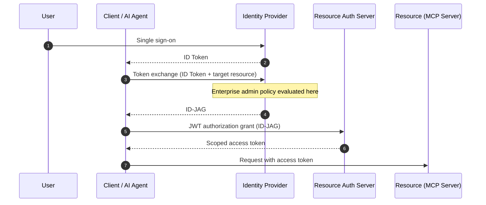

# Kamron Batmanghelich

Hi, I'm Kamron. I've been writing servers since 1998 and still enjoy it more than is probably normal.

By day I work on identity protocols at [@okta](https://github.com/oktadev): OAuth, OIDC, and the
increasingly interesting question of what an AI agent should be allowed to do on your behalf. The
rest of the time I maintain [ModernUO](https://github.com/modernuo/ModernUO), a .NET server runtime
where the units are microseconds and allocations. The two are more alike than they sound. Both are
foundations other people build on top of, and both punish you for guessing.

### Some things I've worked on

|  |  |
| --- | --- |
| Acknowledged in an adopted IETF OAuth working group draft | [draft-ietf-oauth-identity-assertion-authz-grant](https://datatracker.ietf.org/doc/draft-ietf-oauth-identity-assertion-authz-grant/) |
| Built the first prototype applying that draft to the Model Context Protocol. It's now MCP's stable **Enterprise-Managed Authorization** extension | [modelcontextprotocol/ext-auth](https://github.com/modelcontextprotocol/ext-auth/blob/main/specification/stable/enterprise-managed-authorization.mdx) |
| Built and maintain the public ID-JAG reference implementation | [oktadev/id-assertion-authz-node-example](https://github.com/oktadev/id-assertion-authz-node-example) |
| Have maintained, optimized and upgraded a .NET server runtime since 2018 — **over 1,800 commits** | [contributors, 2018 on](https://github.com/modernuo/ModernUO/graphs/contributors?from=2018-01-01&to=2026-12-31&type=c) |
| Replaced a lock-based timer with an O(1) wheel: **474× less CPU** to cancel 50k timers, **zero allocations** | [benchmarks](https://github.com/modernuo/ModernUO-Benchmarks) |
| Saving the same 10M-entity, 1.7 GB world: **RunUO stalls for 60+ seconds. ModernUO does it in ~78 ms.** | [two threads](https://github.com/runuo/runuo/blob/master/Server/Persistence/DualSaveStrategy.cs) vs [chunked fan-out](https://github.com/modernuo/ModernUO/pull/2525) |
| Wrote the first Pokémon legality checker in 2008, proving a save record was genuine from PRNG correlations and undocumented trash bytes | [projectpokemon/Pokemon-Legality-Checker](https://github.com/projectpokemon/Pokemon-Legality-Checker) |
| Have been shipping Ultima Online servers since **1998** | [the 1998 shard, preserved](https://github.com/kamronbatman/GM-Casiopia-Sphere-51a) |

---

### protocol

OAuth, OIDC, SAML, token exchange. I contribute to the IETF **Identity Assertion JWT Authorization
Grant** and tech-lead its implementation at Okta, shipping as
[Cross App Access](https://www.okta.com/newsroom/press-releases/okta-introduces-cross-app-access-to-help-secure-ai-agents-in-the/).

Here's the part I find genuinely fun to explain: OAuth asks a *user* to consent to something the
user usually has no authority to decide. ID-JAG moves that decision to the enterprise admin who
does, and puts the identity provider back in the middle of the exchange where it can be governed.
It's the first OAuth spec to take on the three-party security boundary directly.

The flow, in one diagram

The user is never redirected through a per-server consent screen, and the enterprise sees and
governs every grant.

### platform

I keep ending up as the person who rebuilds a foundation while everyone else keeps building on top
of it. The hard part is never the new design. It's replacing the floor without asking anyone to stop
walking on it, and that's the part I've gotten good at.

At Okta: decomposed a 200-package TypeScript monorepo that had been attempted and abandoned several
times, rebuilt the toolchain and release path for ~20 teams and 80+ engineers, and unblocked the
company design system.

At Bird: split the Kotlin monolith into generated services that registered
themselves with Kubernetes and self-updated as shared infrastructure changed.

### runtime

In 2002, at sixteen, I joined the team building [RunUO](https://github.com/runuo/runuo), an
open-source game server that grew to serve a community in the millions. It was my apprenticeship,
and nothing about it was small. Half a million lines of C#, a scope that rivaled commercial
software, and a team of working engineers and software-engineering graduate students who reviewed
everything I wrote. People ran real communities on top of us and we couldn't afford to break them,
so we documented what we shipped, tested it properly, and worked support cases by the hundreds. That
was professional engineering, years before anyone paid me to do it.

I came back in 2018, this time with a career behind me, and I've spent the eight years since
rebuilding it into [**ModernUO**](https://github.com/modernuo/ModernUO), which now runs on .NET 10.

I created it and run it end to end: architecture, releases, contributor review, and
[the community around it](https://muo.gg/discord). A derivative of its threading and networking
stack runs in production at a
[tracked peak of 3,600 concurrent players](https://uoservers.com/server/uo-outlands).

People hear "game server" and think toy. The techniques below are server techniques. I work them out
here, where I have total architectural freedom, and bring them to company software.

Thread contention, timers, multi-threaded serialization, pathfinding, wire protocol, low-level networking, source generation

- **Thread contention.** A single-threaded game loop with a custom `SynchronizationContext`, so
  `async`/`await` works with zero locks, zero concurrent collections, and no data races possible in
  game code.
- **Timers.** A three-layer hierarchical timer wheel, 4,096 slots per layer, O(1) insert and cancel.
- **Multi-threaded serialization.** Parallel world saves: chunked fan-out across workers, pre-sized
  per-worker heaps, longest-processing-time scheduling. A 10M-entity, 1.7 GB world saves in
  **~78 ms** across 24 cores.
- **Pathfinding.** Bitmap A\* over prebaked per-chunk walkability bitmaps, 2–5× faster in steady
  state.
- **Wire protocol.** A zero-allocation binary protocol built on `Span<byte>`, `stackalloc`, and
  function-pointer handlers.
- **Low-level networking.** [IORingGroup](https://github.com/modernuo/IORingGroup), zero-copy socket
  I/O unifying io_uring, Windows Registered I/O, and kqueue behind one submission/completion
  interface.
- **Source generation.** [SerializationGenerator](https://github.com/modernuo/SerializationGenerator),
  a Roslyn generator emitting versioned serialization across ~4,200 types.

I also contribute to [ClassicUO](https://github.com/ClassicUO/ClassicUO), the client side of the
same wire protocol, so I've implemented both ends of it.

### provenance

Before I worked on identity, I worked on authenticity. Same question, different bytes.

In 2008 I built the first Pokémon legality checker. The community that grew out of it is still going, and the problem turned out to be the one I work on now.

Telling a real Pokémon from a forged one was a hard and genuinely fun problem: decide, from bytes
alone, whether a legitimate process produced this record. That's the question device attestation and
token issuance ask, and I got to meet it first in a place where being wrong cost nothing.

In 2008 I went looking for a way to tell whether a rare event Pokémon was genuine, and found that
there wasn't one. My research led me to [**SCV**](https://projectpokemon.org/home/profile/2-scv/), a
UCLA PhD student who took his handle from his field, several complex variables. The community he
was part of had already established that the games' randomness was predictable, and he taught me the
mathematics behind it: how one seed correlates a dozen traits that look independent. Those findings
were scattered across forum threads and nobody had assembled them. Twenty-five days after I
[wrote down what a checker would have to prove](https://web.archive.org/web/20080608090148/http://forum.pokesav.org/viewtopic.php?f=15&t=119),
I [shipped the first one](https://web.archive.org/web/20081220030734/http://forum.pokesav.org/viewtopic.php?f=23&t=1316),
posting as [**Sabresite**](https://projectpokemon.org/home/profile/4-sabresite/). It read save files
people already had on their own cartridges, it needed no knowledge from the person running it, and
it was the first program that could tell you whether a Pokémon was real.

SCV and I founded [Project Pokémon](https://projectpokemon.org) in 2009 to keep the work going, and
it's still running seventeen years later. What came out of that community is the part worth pointing
at. [PKHeX](https://github.com/kwsch/PKHeX) is the save editor and legality checker almost everyone
uses now, and it validates against the
[Events Gallery](https://github.com/projectpokemon/EventsGallery), the preservation archive we
started. [PokeFinder](https://github.com/Admiral-Fish/PokeFinder) predicts the games' RNG on real
hardware, so you can obtain a specific Pokémon by just playing. Gen 5 shipped with a Mersenne
Twister and 64-bit seeds in place of the generator everyone had characterized.

Legality checking also stopped being a hobbyist concern. The 2023 World Championships
[disqualified players for hacked Pokémon](https://www.nintendolife.com/news/2023/08/pokemon-world-championships-disqualifies-scarlet-and-violet-pros-using-hacked-monsters)
after full storage checks, and an analysis of 850+ competitive rental teams found
[roughly 17% of Worlds teams carrying them](https://kotaku.com/pokemon-scarlet-violet-dlc-cheating-hacked-genned-pkhex-1850758535).
The fields those checks read are event flags and met data, which are two of the rules I wrote down
in that June 2008 post.

I care about this for the same reason I like protocol work. Event Pokémon were being sold to people
who had no way to know what they were buying, and the fix wasn't a rule. It was making authenticity
checkable by anyone, for free. That was the goal in the
[first post I ever wrote about it](https://web.archive.org/web/20080608090148/http://forum.pokesav.org/viewtopic.php?f=15&t=119),
in June 2008: *"At least now everyone can get a legit shiny US event pokemon for free."* I'm a
preservationist, a completionist, and I don't believe money should be a barrier to something you
love.

**How you prove a save-file record is genuine when nothing about it is documented.** Two independent
fingerprints, and a forgery has to survive both.

**The PRNG.** A legitimate Pokémon's traits aren't independent of each other. Nature, gender,
ability, shininess, and its six hidden stats all fall out of a single seed. Edit any one of them and
the correlation breaks, even though every individual value still looks perfectly ordinary. Nothing
about this is visible in the game.

**Trash data.** The game writes names into fixed-size buffers and doesn't clear what was there
before, so every record carries residue. *Which* residue depends on how that Pokémon came to exist,
which is why a Pal Park transfer looks different from a Mystery Gift. Once the community had
established what that residue should look like for each origin, the checker could use it as a second
fingerprint. Forgers don't reproduce it, because nothing tells them it's there.

I believe we were the first to document that combination: a statistical check plus a structural one,
each catching what the other misses.

The rest was rules, and there were a lot of them. Encounter type against location and level, ability
against evolution stage, EV totals, bred-only moves on Pokémon that were never bred, met dates, Pal
Park transfers cross-checked against the ball they were caught in, and whether a Drifloon was caught
on a Friday, because Fridays are the only day it appears. Authenticity checking turns out to mean
modeling the entire world the artifact came from, which is also true of the identity work.

---

If any of this overlaps with something you're working on, I'd like to hear about it. Issues and
discussions on any of these repos are a fine place to start.
